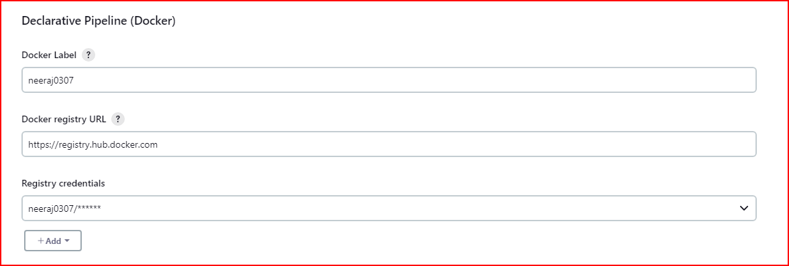

# DevOps CapStone Project Applications Deployment

### Project [GitHub Repo URL](https://github.com/psaineeraj0301/FinalProject)
### Project [Doc](https://docs.google.com/document/d/1raDCcOAkHiSI_vIy3itm25r5TcNS6mJuPx-CNOY9F7Y/edit?usp=sharing)
### Running [Project App](http://ec2-35-160-146-190.us-west-2.compute.amazonaws.com/)
 
Branch 
> - `master` 
> - `dev`

## AWS setup
1. **Security Group**
   > Inbound Rule 
     
     
   > Outbound Rule 
     

2. **EC2 Console**
     

## Jenkins
1. **Jenkins Login**
     
2. **Configuration**
   - Docker Plugin 
     
   - GitHub Server Connection  
     
   - PipeLine
       
3. **Execution Steps**
   - PipeLine Stage View 
     

## Docker Hub
1. Docker Hub Dashboard with `prod` *private* repo and `dev` *public* repo
     
2. Prod Repo with images  
3. Dev Repo with images  

## Deployed App 
 
## Monitoring
### Prometheus
1. Prometheus Graph    
2. Prometheus Console    

### Grafana
1. Grafana Dashboard 
  
  - Grafana Metric 
    

